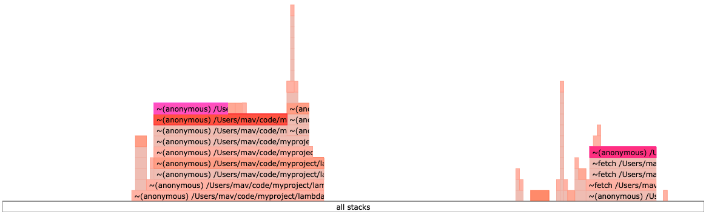

I maintain and operate a set of [Lambda functions on AWS](https://aws.amazon.com/lambda/), most of which provide the implementation for an [API Gateway](https://aws.amazon.com/api-gateway/) depended on for an internal tool.
These are written primarily in JavaScript using the [Node.js runtime](https://docs.aws.amazon.com/lambda/latest/dg/lambda-nodejs.html) and [deployed with Docker](https://docs.aws.amazon.com/lambda/latest/dg/nodejs-image.html).

Recently, I worked to address what felt like a recurring ghost haunting the internal tool: sporadically, and at random, API endpoints would time out and serve nothing to clients.
These errors had to be reported anecdotally - our logging and alerting showed nothing going awry and our metrics were still evolving.
So, with some downtime, I took it upon myself to discover what was going on and hopefully learn something in the process.

## Be data-driven

I strongly believe the best way to improve something is to first measure it.
To this point, I had suspected something strange was going on with our tool, but the timeouts were infrequent and hard to reproduce.
I wanted data to prove that this problem was actually happening, to gauge its severity, and to orient myself with what may be causing it.

Given the API Gateway was the service timing out, it made sense to first investigate what its metrics could tell us about the problem.

API Gateway offers a [large set of metrics](https://docs.aws.amazon.com/apigateway/latest/developerguide/api-gateway-metrics-and-dimensions.html) out of the box.
One in particular, `IntegrationLatency`, was exactly what I was looking for.
I created a visualization in [Cloudwatch](https://aws.amazon.com/cloudwatch/) to plot this metric and observe what it told me:


The problem was definitely not in my head: the distribution above shows that the vast majority of requests were being served in a timely manner (errors or otherwise), but some would spike to nearly 30000 milliseconds (our time out threshold).

## Follow your intuition

The logs from the API Gateway didn't indicate any issues beyond timeouts occurring at random and no [AWS Health](https://health.aws.amazon.com/health/status) events had occurred for our region and services within this time period.

So, I suspected the problem involved the implementation of our Lambda functions.
Two scenarios were obvious to me.
Either the I/O they performed (external network calls) would sometimes spike, causing the timeouts, or the lambdas were slow to re-initialize after being deallocated (i.e. a slow cold start).

Since we had no observability beyond application logs, I plumbed in [X-Ray](https://aws.amazon.com/xray/) to capture more detailed traces for the Lambda functions and waited for the "ghost" to haunt us again.
Combined with cross-referencing the API Gateway `IntegrationLatency` metric, pinpointing one of these events was simple.

Lo and behold, we observed the following from one of our traces:


The initialization of the function took nearly 20 seconds whereas the invocation was around 2 and a half seconds!
So, definitively, our problem was that our cold start times were drastically slower than acceptable for our use case.

To fix this, there were two obvious options.

We could throw money at the problem. Using [provisioned concurrency](https://docs.aws.amazon.com/lambda/latest/dg/provisioned-concurrency.html), we could keep one lambda warm indefinitely and ready to serve requests.

Or, we could investigate _why_ the cold starts were taking so long. Was this a problem with our Docker configuration, our application code, or something else?

Given there were several lambda functions for this internal tool and more on the way, having to configure provisioned concurrency for each seemed to defeat the purpose of using Lambda functions in the first place: we wanted cost savings for infrequently used business processes.
So, I opted to investigate and attempt to address the core issue.

## Identify the root cause

I wanted more data about what was happening inside our Lambda functions to properly identify the core issue.

AWS offers a profiling service called [CodeGuru Profiler](https://docs.aws.amazon.com/codeguru/latest/profiler-ug/what-is-codeguru-profiler.html) to collect profiling data about Lambda functions.
However, our runtime (`Node.js`) was not supported.
So, I opted to profile the code locally.
If the initialization time is slow on a Lambda, it would probably also be slow on a local machine since the runtimes are the same.

To do this, I used [0x](https://www.npmjs.com/package/0x) to capture a flame graph of the invocation of the lambda function locally from a script.

The results were telling:


The left hand side of this graph indicates the time spent initializing the Lambda's handler, whereas the right hand side indicates the amount of time spent invoking the Lambda's handler.

Digging into the initialization trace, I noticed several branches of code being imported that weren't necessary for the invocation of this function via the `common` directory.
The architecture of this project had each Lambda import from a shared module (`common`) in order to promote code re-use.
This module exported all its dependencies in one barrel file, for example:

```javascript
// common/index.js

const { fooFn1, fooFn2 } = require('./src/foo')
const { barFn1, barFn2 } = require('./src/bar')
const { bazFn1, bazFn2 } = require('./src/baz')

module.exports = {
  fooFn1,
  fooFn2,
  barFn1,
  barFn2,
  bazFn1,
  bazFn2
}

// mylambda.js
const { fooFn1, barFn1, bazFn1 } = require('common')

module.exports = (event, context) => {
  ...
}
```

Some of these modules wrapped third party dependencies which were quite large. So, this was the problem!

## Solve the problem

We had to refactor this large shared module into a set of smaller modules and allow the Lambda functions to import the dependencies they needed piecemeal.
Doing this meant we would only be importing the dependencies required for each Lambda, reducing the amount of code that needed to be initialized.

In the future, we could look to implementing tree-shaking should this problem recur with our new compartmentalized modules.

In practice, this looked like:

```javascript
// common/foo/index.js

const { fooFn1, fooFn2 } = require('./src/foo')

module.exports = {
  fooFn1,
  fooFn2,
}

// common/bar/index.js

const { barFn1, barFn2 } = require('./src/bar')

module.exports = {
  barFn1,
  barFn2,
}

// common/baz/index.js

const { bazFn1, bazFn2 } = require('./src/baz')

module.exports = {
  bazFn1,
  bazFn2
}

// mylambda.js
const { fooFn1 } = require('common/foo')
const { barFn1 } = require('common/bar')
const { bazFn1 } = require('common/baz')

module.exports = (event, context) => {
  ...
}
```

## Check your work

After having made this change, we re-ran our measurements and observed whether we had fixed the problem.

Our flame graph showed a dramatic reduction in initialization time relative to invocation time:



Further, our Lambda trace confirmed that the initialization time was reduced to an acceptable threshold on cold starts:


And finally, we haven't observed this issue again from our latency metric post deployment (August 5th):


## Final thoughts

Getting to dig deep into technical problems is one of my favourite things about the work I do.
From having done this investigation, we were able to set up new metrics and alerting to catch and prevent this issue from recurring again in the future.
Moreover, it informed changes to how we architect our software when targeting Lambda functions for deployment.

Thank you for taking the time to read this technoblather.
Hopefully, you were able to learn something from my experience.
Write me an email or a message on LinkedIn if so, and don't be a stranger.
