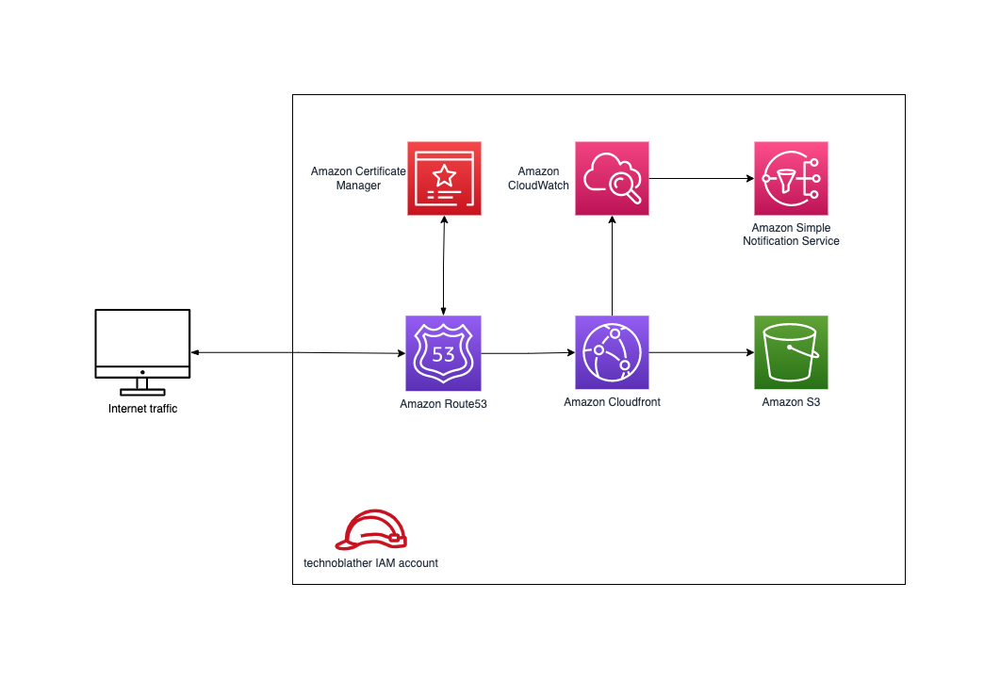

## What is this and why am I here?

First and foremost: I'll skip any references to ontology with a subtitle like that.

If you've ever worked with me, you've likely listened to me whinge about our (developers) lack of conscientiousness
towards how the software we develop is operated. Are the logs any good? Do we expose any metrics? Is the code performant
under load? And so forth. Anecdotally, most companies that employ developers make it someone else's problem to deal with
whatever the developers produce. Obviously that means we generally do a terrible job of it, and we ought not as an
expression of our professional practice.

People smarter than myself have identified this as a problem (and you can probably tell I agree with them). This
identification has given rise to a new approach regarding software development team practices
called [DevOps](https://en.wikipedia.org/wiki/DevOps). Ignore the fact that colloquially DevOps has become a catch-all
aggregate job role for operations, system administration, platform development, cloud development, and whatever you call
writing pipelines (yaml configurator?). Ideally, a team practicing this methodology will have engineers work across the
entire application lifecycle, from development and test to deployment to operations, and develop a range of skills not
limited to a single function [[1]](https://aws.amazon.com/devops/what-is-devops/).

This sounds great and is a lofty goal for any technical team to achieve. In the pursuit of developing the capability to
walk-the-talk, I recently attained
a [Solutions Architect – Associate](https://www.credly.com/badges/e056b75f-16ea-4d6d-8f70-b971fb067c59/public_url)
certification with Amazon and have an eye towards attaining
the [DevOps Engineer - Professional](https://aws.amazon.com/certification/certified-devops-engineer-professional/)
certification this year.

And so, this brings us to our main point: I wanted a project to both crystallize some of what I learned via studying and
test taking for the aforementioned certification and to engage in open learning via blogging as a public journal of my
professional development. And so, with the intention of using AWS services and industry standard tooling, I made a blog.

## Ok - so you made a blog

Not just any blog though - a _good blog_. But what does that mean? Blogs are meant to be read, and as such we'll want to
optimize for SEO. From a technical perspective then, we should prioritize solutions that consider:

* Performance: a blog should be really, really fast to deliver content.
* Accessibility: a blog should be accessible to all users.
* Trustable: a blog should encrypt traffic, not spam users, not engage in dark-pattern UI distractions, and so forth.
* Machine-crawlability: a blog should include all the metadata search engines expect and be crawlable to get higher
  search rankings.

Furthermore, I wanted to utilize "best practices" from a DevOps perspective with my technical decisions. And so, to
facilitate this:

* For the blog engine, I chose [Gatsby](https://www.gatsbyjs.com/). Architecting the blog as static content means it's
  easy to cache and removes the need for any server side infrastructure.
* For operating the blog, I chose [AWS](https://aws.amazon.com/). This is the industry standard for operating services
  in the cloud.
* For configuring the infrastructure, I chose [Terraform](https://www.terraform.io/) as an infrastructure-as-code
  solution. Likewise, the industry standard IaC solution.
* To deploy the blog, I opted to use [Github Actions](https://github.com/features/actions) to set up continuous
  integration and deployment pipelines. Github is being used for version control already and actions integrates with
  this well.

## High level technoblather

Before delving into the details of the terraform declarations, I'd like to give an overview of the services used and how
they relate to one another:

* IAM for defining groups and policies to operate the solution
* Route53 for DNS management
* Certificate Manager for provisioning an SSL certificate
* Cloudfront for distributing and caching the blog
* S3 for storing terraform state and blog content
* SNS for publishing events related to operating the blog
* Cloudwatch for acting on events (e.g., alerting)

This will look familiar if you've ever hosted a static website via S3. Everything detailed in this blog post could just
as well be applied to a single page application, e.g. a React app.

Visualized, this looks like:



## Getting into the nitty-gritty

Now, let's get into the details. We'll begin with explaining the IAM user administering this account, moving onto the
services used from the front to the back of web traffic, ending with a brief overview of how the pipelines are set up.
You can find all code referenced in [this github repository](https://github.com/laaksomavrick/devblog).

### Creating an IAM user for the project

You should never use your root account for provisioning resources for a project and instead embrace applying
least-privilege permissions to an IAM user, group, or
role [[2]](https://docs.aws.amazon.com/IAM/latest/UserGuide/best-practices.html). For this project, I opted to create a
separate IAM user with the following amazon managed policies attached from my `AdministratorAccess` account.

* AmazonS3FullAccess
* CloudWatchFullAccess
* CloudFrontFullAccess
* AmazonSNSFullAccess
* AmazonRoute53FullAccess
* AWSCertificateManagerFullAccess

This isn't in the terraform declarations because I needed it prior to writing the terraform declarations (i.e., while I
was figuring out how to do all this). In other words, a typical chicken-and-egg problem. In retrospect, I could have
used a `AdministratorAccess` designated account to create this IAM user via terraform and then assume the created IAM
user for all subsequent commands. But, this was still the experimental stage.

### Authoring the infrastructure

Prepare yourself for lots of [HCL](https://developer.hashicorp.com/terraform/language/syntax/configuration).

We'll start with the module entry point (`main.tf`), my provider declarations (`aws.tf`), and my terraform
variables (`variables.tf`)

```hcl
# main.tf

terraform {
  required_providers {
    aws = {
      source  = "hashicorp/aws"
      version = "~> 4.16"
    }
  }

  backend "s3" {
    bucket = "technoblather-terraform"
    key    = "tfstate"
    region = "ca-central-1"
  }

  required_version = ">= 1.2.0"
}
```

I opted to use `ca-central-1` everywhere I could since I live nowhere close to Toronto. You'll see shortly that this led
to a few gotchas related to certificate management and Cloudfront.

```hcl
# aws.tf

provider "aws" {
  region                   = "ca-central-1"
  shared_credentials_files = ["~/.aws/credentials"]
  profile                  = "technoblather"
}

provider "aws" {
  alias  = "acm_provider"
  region = "us-east-1"
}
```

Aforementioned solution to the gotchas - the latter aws provider block specifies `us-east-1` for services that aren't
operable outside that
region [[3]](https://docs.aws.amazon.com/AmazonCloudFront/latest/DeveloperGuide/cnames-and-https-requirements.html).
Basically, you need to use `us-east-1` to set up SSL with Cloudfront.

```hcl
# variables.tf

variable "domain_name" {
  type        = string
  description = "The domain name for the website."
}

variable "bucket_name" {
  type        = string
  description = "The name of the bucket without the www. prefix. Normally domain_name."
}

variable "common_tags" {
  description = "Common tags you want applied to all components."
}

variable "alert_emails" {
  type        = list(string)
  description = "A list of emails for alerting via cloudwatch alarms."
}
```

No surprises here. One good practice I adopted was issuing a uniform set of tags for each resource since it made
winnowing down billing for this project easier, e.g.:

```hcl
common_tags = {
  Project = "technoblather"
}
```

#### Route53 and Certificate Manager

Moving onto DNS. The vast majority of my career has been in development, so DNS and SSL are one of those things I've
skimmed a how-to as little as possible and moved on. Trying to make amends here - I have a few hobby projects I operate
now (sole user) and know the difference between an `A` record and a `CNAME`. Also smart enough to delegate certificate
renewal to an automated process or a service.

```hcl
# route53.tf

resource "aws_route53_zone" "main" {
  name = var.domain_name
  tags = var.common_tags
}

resource "aws_route53_record" "root-a" {
  zone_id = aws_route53_zone.main.zone_id
  name    = var.domain_name
  type    = "A"

  alias {
    name                   = aws_cloudfront_distribution.root_s3_distribution.domain_name
    zone_id                = aws_cloudfront_distribution.root_s3_distribution.hosted_zone_id
    evaluate_target_health = false
  }
}

resource "aws_route53_record" "www-a" {
  zone_id = aws_route53_zone.main.zone_id
  name    = "www.${var.domain_name}"
  type    = "A"

  alias {
    name                   = aws_cloudfront_distribution.www_s3_distribution.domain_name
    zone_id                = aws_cloudfront_distribution.www_s3_distribution.hosted_zone_id
    evaluate_target_health = false
  }
}

resource "aws_route53_record" "main" {
  for_each = {
  for dvo in aws_acm_certificate.ssl_certificate.domain_validation_options : dvo.domain_name => {
    name   = dvo.resource_record_name
    record = dvo.resource_record_value
    type   = dvo.resource_record_type
  }
  }
  allow_overwrite = true
  name            = each.value.name
  records         = [each.value.record]
  ttl             = 60
  type            = each.value.type
  zone_id         = aws_route53_zone.main.zone_id
}
```

Here, we have two declarations for `A` records (`www.technoblather.ca` and `technoblather.ca`) which lets Route53 handle
requests for our domain and traffic them to the appropriate service (Cloudfront).

You'll notice a recurring duplication between a `www` resource and a `root` resource as we proceed down the service
stack. This is because I needed two buckets in order to handle url
redirection [[4]](https://docs.aws.amazon.com/AmazonS3/latest/userguide/how-to-page-redirect.html#redirect-endpoint-host)
. I didn't want a request to `technoblather.ca` to result in a `404`, so `root` functions as a redirect to my `www`
bucket.

```hcl
# acm.tf

resource "aws_acm_certificate" "ssl_certificate" {
  provider                  = aws.acm_provider
  domain_name               = var.domain_name
  subject_alternative_names = ["*.${var.domain_name}"]
  validation_method         = "DNS"

  tags = var.common_tags

  lifecycle {
    create_before_destroy = true
  }
}

resource "aws_acm_certificate_validation" "cert_validation" {
  provider                = aws.acm_provider
  certificate_arn         = aws_acm_certificate.ssl_certificate.arn
  validation_record_fqdns = [for record in aws_route53_record.main : record.fqdn]
}
```

Here we're setting up SSL for our domain name. This is almost verbatim copied
from [the terraform documentation](https://registry.terraform.io/providers/hashicorp/aws/latest/docs/resources/acm_certificate_validation)
. Setting up `DNS` validation is recommended and was easier than trying to register a mail server for my domain. Note
the usage of the `aws.acm_provider` to set SSL certificates up via `us-east-1`. Validating my domain took some time (
nearly an hour) which had me wondering whether I had misconfigured something.

#### Cloudfront

Cloudfront is a CDN which we can use to have low latency responses to requests for our content. We use it to cache the
content of our blog through a distribution, specifying the origin (S3), security parameters (e.g. SSL enforcement),
geographic restrictions, and caching
behaviours [[5]](https://docs.aws.amazon.com/AmazonCloudFront/latest/DeveloperGuide/distribution-overview.html)

```hcl
# cloudfront.tf

resource "aws_cloudfront_distribution" "www_s3_distribution" {

  origin {
    domain_name              = aws_s3_bucket.www_bucket.bucket_regional_domain_name
    origin_access_control_id = aws_cloudfront_origin_access_control.www_s3_origin_access_control.id
    origin_id                = "S3-www.${var.bucket_name}"
  }

  enabled             = true
  is_ipv6_enabled     = true
  default_root_object = "index.html"

  aliases = ["www.${var.domain_name}"]

  custom_error_response {
    error_caching_min_ttl = 0
    error_code            = 404
    response_code         = 200
    response_page_path    = "/404.html"
  }

  default_cache_behavior {
    allowed_methods  = ["GET", "HEAD"]
    cached_methods   = ["GET", "HEAD"]
    target_origin_id = "S3-www.${var.bucket_name}"

    forwarded_values {
      query_string = false

      cookies {
        forward = "none"
      }
    }

    viewer_protocol_policy = "redirect-to-https"
    min_ttl                = 31536000
    default_ttl            = 31536000
    max_ttl                = 31536000
    compress               = true
  }

  restrictions {
    geo_restriction {
      restriction_type = "none"
    }
  }

  viewer_certificate {
    acm_certificate_arn      = aws_acm_certificate_validation.cert_validation.certificate_arn
    ssl_support_method       = "sni-only"
    minimum_protocol_version = "TLSv1.1_2016"
  }

  tags = var.common_tags
}

resource "aws_cloudfront_origin_access_control" "www_s3_origin_access_control" {
  name                              = "www-s3-origin-access-control"
  description                       = ""
  origin_access_control_origin_type = "s3"
  signing_behavior                  = "always"
  signing_protocol                  = "sigv4"
}

# Cloudfront S3 for redirect to www.
resource "aws_cloudfront_distribution" "root_s3_distribution" {
  origin {
    domain_name              = aws_s3_bucket.root_bucket.bucket_regional_domain_name
    origin_access_control_id = aws_cloudfront_origin_access_control.root_s3_origin_access_control.id
    origin_id                = "S3-.${var.bucket_name}"
  }

  enabled         = true
  is_ipv6_enabled = true

  aliases = [var.domain_name]

  default_cache_behavior {
    allowed_methods  = ["GET", "HEAD"]
    cached_methods   = ["GET", "HEAD"]
    target_origin_id = "S3-.${var.bucket_name}"

    forwarded_values {
      query_string = true

      cookies {
        forward = "none"
      }

      headers = ["Origin"]
    }

    viewer_protocol_policy = "allow-all"
    min_ttl                = 0
    default_ttl            = 86400
    max_ttl                = 31536000
  }

  restrictions {
    geo_restriction {
      restriction_type = "none"
    }
  }

  viewer_certificate {
    acm_certificate_arn      = aws_acm_certificate_validation.cert_validation.certificate_arn
    ssl_support_method       = "sni-only"
    minimum_protocol_version = "TLSv1.1_2016"
  }

  tags = var.common_tags
}


resource "aws_cloudfront_origin_access_control" "root_s3_origin_access_control" {
  name                              = "root-s3-origin-access-control"
  description                       = ""
  origin_access_control_origin_type = "s3"
  signing_behavior                  = "always"
  signing_protocol                  = "sigv4"
}

```

Of note here: our origin is our S3 bucket, our root object is `index.html`, we restrict access to the S3 bucket by
specifying an `aws_cloudfront_origin_access_control` such that only cloudfront can access it, we enforce SSL, and we set
up our cache properties (TTL, compression).

So, this means that all requests must be routed through cloudfront - accessing our bucket via the bucket url will result in a
rejected request. HTTP requests will be redirected to https. Content is cached for as long as possible - the only time we want
the cache to be invalidated is upon a new deployment (you'll see later that our CI/CD pipeline invalidates the
distribution when deploying changes).

Via Google's Lighthouse tool, this configuration was evaluated with a 100/100 for performance. Not too shabby.

#### S3

Blog content is hosted in S3. One bucket contains the build output from Gatsby, the other serves as a redirect to the
aforementioned bucket. Of note, these buckets are private and only accessible to our specified Cloudfront distribution.
Versioning is also enabled in case of any oopses.

```hcl
# www_bucket.tf

resource "aws_s3_bucket" "www_bucket" {
  bucket = "www.${var.bucket_name}"
  tags   = var.common_tags
}

resource "aws_s3_bucket_acl" "blog_acl" {
  bucket = aws_s3_bucket.www_bucket.id
  acl    = "private"
}

resource "aws_s3_bucket_versioning" "blog_versioning" {
  bucket = aws_s3_bucket.www_bucket.id
  versioning_configuration {
    status = "Enabled"
  }
}

resource "aws_s3_bucket_website_configuration" "blog_website_configuration" {
  bucket = aws_s3_bucket.www_bucket.id

  index_document {
    suffix = "index.html"
  }

  error_document {
    key = "404.html"
  }
}

resource "aws_s3_bucket_policy" "blog_policy" {
  bucket = aws_s3_bucket.www_bucket.id
  policy = templatefile("templates/s3-policy.json", {
    bucket = "www.${var.bucket_name}", cloudfront_arn = aws_cloudfront_distribution.www_s3_distribution.arn
  })
}

resource "aws_s3_bucket_cors_configuration" "blog_cors_configuration" {
  bucket = aws_s3_bucket.www_bucket.id

  cors_rule {
    allowed_headers = ["Authorization", "Content-Length"]
    allowed_methods = ["GET", "POST"]
    allowed_origins = ["https://www.${var.domain_name}"]
    max_age_seconds = 3000
  }
}
```

```hcl
# root_bucket.tf

resource "aws_s3_bucket" "root_bucket" {
  bucket = var.bucket_name
  tags   = var.common_tags
}

resource "aws_s3_bucket_policy" "root_blog_policy" {
  bucket = aws_s3_bucket.root_bucket.id
  policy = templatefile("templates/s3-policy.json", {
    bucket = var.bucket_name, cloudfront_arn = aws_cloudfront_distribution.root_s3_distribution.arn
  })
}

resource "aws_s3_bucket_acl" "root_acl" {
  bucket = aws_s3_bucket.root_bucket.id
  acl    = "private"
}

resource "aws_s3_bucket_website_configuration" "root_blog_website_configuration" {
  bucket = aws_s3_bucket.root_bucket.id
  redirect_all_requests_to {
    host_name = "www.${var.domain_name}"
    protocol  = "https"
  }
}
```

```json
// s3-policy.json
        
{
  "Version": "2012-10-17",
  "Statement": {
    "Sid": "AllowCloudFrontServicePrincipalReadOnly",
    "Effect": "Allow",
    "Principal": {
      "Service": "cloudfront.amazonaws.com"
    },
    "Action": "s3:GetObject",
    "Resource": "arn:aws:s3:::${bucket}/*",
    "Condition": {
      "StringEquals": {
        "AWS:SourceArn": "${cloudfront_arn}"
      }
    }
  }
}

```

#### Cloudwatch Alarms and SNS

In the interest of improving my capabilities around operating software, I wanted to make sure I had some form of monitoring and alerting in place. Cloudfront publishes some metrics by default which can be consumed by Cloudwatch [[6]](https://docs.aws.amazon.com/AmazonCloudFront/latest/DeveloperGuide/monitoring-using-cloudwatch.html). So, I figured I should send myself an email if my blog ever begins returning a `500` error (i.e., something unexpected has gone wrong and my content is no longer online).


```hcl
# cloudwatch.tf

resource "aws_cloudwatch_metric_alarm" "blog_broken_alarm" {
  provider            = aws.acm_provider
  alarm_name          = "blog-broken-alarm"
  comparison_operator = "GreaterThanOrEqualToThreshold"
  evaluation_periods  = "1"
  metric_name         = "5xxErrorRate"
  namespace           = "AWS/CloudFront"
  period              = "60"
  statistic           = "Average"
  threshold           = "1"
  treat_missing_data  = "notBreaching"

  alarm_description = "Monitors whenever average error rate exceeds 1%"
  alarm_actions     = [aws_sns_topic.technoblather_sns_topic_500_error_threshold_exceeded.arn]

  dimensions = {
    DistributionId = aws_cloudfront_distribution.www_s3_distribution.id
    Region         = "Global"
  }

  tags = var.common_tags
}
```

```hcl
# sns.tf

resource "aws_sns_topic" "technoblather_sns_topic_500_error_threshold_exceeded" {
  provider = aws.acm_provider
  name     = "technoblather-500-error-threshold-exceeded"
  delivery_policy = jsonencode({
    "http" : {
      "defaultHealthyRetryPolicy" : {
        "minDelayTarget" : 20,
        "maxDelayTarget" : 20,
        "numRetries" : 3,
        "numMaxDelayRetries" : 0,
        "numNoDelayRetries" : 0,
        "numMinDelayRetries" : 0,
        "backoffFunction" : "linear"
      },
      "disableSubscriptionOverrides" : false,
      "defaultThrottlePolicy" : {
        "maxReceivesPerSecond" : 1
      }
    }
  })
  tags = var.common_tags
}

resource "aws_sns_topic_subscription" "technoblather_sns_topic_500_error_threshold_exceeded_email_subscription" {
  provider  = aws.acm_provider
  count     = length(var.alert_emails)
  topic_arn = aws_sns_topic.technoblather_sns_topic_500_error_threshold_exceeded.arn
  protocol  = "email"
  endpoint  = var.alert_emails[count.index]
}
```

The `5xxErrorRate` metric triggers an alarm if the _average threshold of errors is >= 1 within a minute_. In plain language, if it ever happens, I'll get an alarm. One gotcha I had while setting this up was configuring the `treat_missing_data` to explicitly be `notBreaching`. This means no data being returned will be an `OK` instead of an `INSUFFICIENT_DATA`. In our case, no data is a good thing.

The alarm triggers an event to be published to an SNS topic. That topic has a subscription resulting in an email being triggered as a result.

So, whenever a `5xx` happens from a request to the blog, the `alert_emails` get an email. I was able to test this using the [set-alarm-state](https://docs.aws.amazon.com/cli/latest/reference/cloudwatch/set-alarm-state.html) command from the `aws` cli.

#### Authoring the CI/CD pipeline

Here things became more familiar for me. There are two processes I wanted to automate:
* Verifying the changes we're pushing on a pull request are standardized
* Deploying the changes when they've been merged

For the first, we run formatters and check that gatsby can build without throwing an error.

For the latter, we build an output artifact via Gatsby, sync it to S3, and invalidate our Cloudformation distribution to break the cache.

```yml
# verify_pull_request.yml

name: Verify pull request

on:
  pull_request:
    branches: [ main ]

jobs:
  verify:
    name: Build
    runs-on: ubuntu-latest
    steps:
      - uses: actions/checkout@v1

      - name: Setup Node
        uses: actions/setup-node@v3
        with:
          node-version: 18

      - name: Setup terraform
        uses: hashicorp/setup-terraform@v2
        with:
          terraform_version: 1.1.7

      - name: Install node dependencies
        run: npm ci

      - name: Prettier fmt
        run: npm run format:check

      - name: Terraform fmt
        run: terraform fmt -check

      - name: Terraform Validate
        run: terraform validate -no-color

      - name: Gatsby build
        run: npm run build
```

```yml
# deploy_to_s3.yml

name: Deploy to s3 and refresh cloudfront

on:
  push:
    branches: [ main ]

jobs:
  deploy-to-s3:
    runs-on: ubuntu-latest
    permissions:
      id-token: write
      contents: read
    steps:
      - name: Checkout main
        uses: actions/checkout@v2

      - name: Setup Node
        uses: actions/setup-node@v3
        with:
          node-version: 18

      - name: Install node dependencies
        run: npm ci

      - name: Build production artifact
        run: npm run build

      - name: Configure AWS credentials
        uses: aws-actions/configure-aws-credentials@v1
        with:
          role-to-assume: ${{ vars.RUNNER_AWS_ROLE_ID }}
          aws-region: ca-central-1

      - name: Deploy technoblather to S3
        run: |
          aws s3 sync public ${{ vars.BUCKET_ID }}

      - name: Invalidate Cloudfront cache
        run: |
          aws cloudfront create-invalidation --distribution-id ${{ vars.CLOUDFRONT_ID }} --paths "/*";
```

Notably, the AWS secret and environment variables are plumbed through Github's repository settings. I did have to set up an OIDC provider as per AWS's Github Action documentation [[7]](https://github.com/aws-actions/configure-aws-credentials#assuming-a-role) to facilitate this in a secure way. 

## So, what's next?

We covered a large quantity of information scrolling through the 2000 and some words to this point. There are a number of next steps I have planned with the intention of validating more of my knowledge (and simply learning new things). While not exhaustive, next steps (for your own blog, perhaps) could be:
* Setting up request logging in Cloudfront
* Creating more alarms for metrics published to Cloudwatch (e.g. p99 latency, cache misses)
* Setting up DDoS protection with AWS WAF and/or AWS Shield
* Setting up a staging environment to validate changes before deploying to production
* Setting up a budget via AWS Budgets

...and more I can't even think of.

I'll likely write some more posts on these topics as I make my way through them alongside my other hobby projects. Notably, I operate a [weightlifting application](https://hugelifts.ca/) and a [goal tracking application](https://ownyourday.ca/). Sign ups for both are disabled (aside from my partner who graciously humours me) as I don't want to support users (yet).

## Conclusion

Did this blog meet my goals? Aforementioned criteria, learning things, new tool for engaging with the developer community and promotion of open learning? 