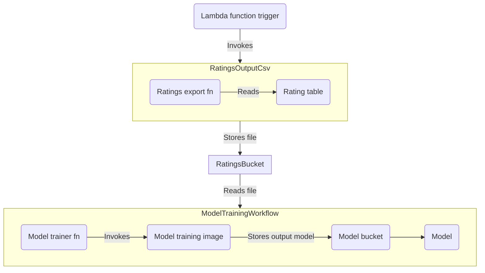
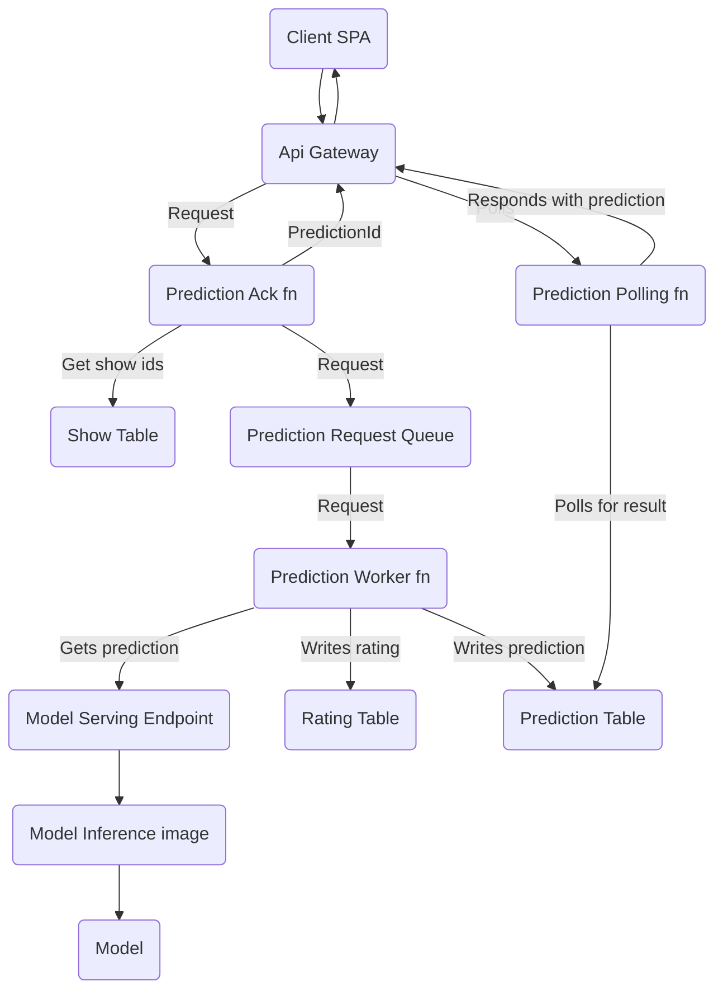
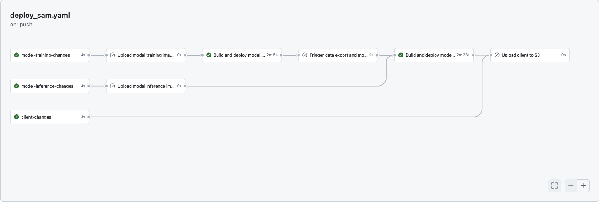

It's no secret technology circles are currently experiencing peak levels of hype regarding AI and machine learning.
If you're reading this blog post, you likely know this from your anecdotal experience.
To name a few examples, ChatGPT can more often than not write acceptable code snippets and DALL·E's image engine can generate uninspired but highly useful reproductions.

Further, every quarter brings forth new capabilities, expansions, and utilization of the core technologies backing these models.
So, maybe the hype is [somewhat justified](https://www.google.com/finance/quote/NVDA:NASDAQ?window=6M) (the author is aware at the time of writing that this graph may change quite dramatically in the future, and the hype may then be somewhat unjustified).

I am not smart enough to know for sure.
But, with its collective capture of our attention, I do know it's certain to be useful to learn something about the capabilities AI offers and the techniques we can leverage as software developers to capitalize.

And so, as is my typical pattern, I wanted to build a hobby project end-to-end leveraging AI and/or machine learning to solve a small problem and learn something along the way. I settled on developing [a recommendation engine to recommend television shows](https://canihasashowplz.com/) based on input user preferences, given:

- I thought it would be fun to build something that could help my spouse and myself choose a new television show to watch in the evenings.
- Recommendation engines are a feature I use in my daily life in my software products: Spotify's music recommendations, Amazon's product recommendations, the gajillion ads I am served which I do my best to block, and so on.
- A large public data set exists for movies, but not television shows, so I knew I would have to get the data myself, and I wanted an end-to-end experience.

With that in mind, this blog post serves as a compilation of my scratchpad notes from developing the engine, hopefully providing a good recollection and reflection on the experience that can help those reading with their own work and/or fun.

## Building the model

The closest I come to being a data scientist in my day-to-day life is having lap time telemetry side-by-side with Formula One races on the weekends.
I stopped learning mathematics formally in grade 11 (priorities were more centered around raising my ELO in video games than they were with doing 50 brain teasers every evening) and only came back to it in a round-about way with discrete mathematics when I segued from English and philosophy to computer science late in my post-secondary journey.

That is to say, I really don't know linear algebra, and at this point, with my [limited and declining dendrites](https://www.ncbi.nlm.nih.gov/pmc/articles/PMC4906299/), I don't want to know.

So, naturally, my first step towards building a model to back a recommendation system was to [buy a book written by someone smarter than me](https://www.amazon.ca/Hands-Machine-Learning-Scikit-Learn-TensorFlow/dp/1491962291) (generously paid for by an employer-backed stipend, thank you [Test Double](https://testdouble.com/)) and blindly follow its instructions, varying the approach to suit my specific domain.

The gist of the process comes down to the following steps:

- Examine your data set and develop an intuition for its features (i.e., properties for you developers out there) and their relationships.
- Prepare the data to suit a particular algorithm or approach you would like to attempt.
- Select and train a model.
- Develop a heuristic for evaluating the model.
- Apply the heuristic and note the results.
- Repeat the process until you are happy with the results.

### Politely stealing data

As noted, I did not have a data set publicly available to me that met my needs.
Given my goal of a recommendation engine based on user preferences, I needed data that:

- Had a feature indicating a particular user (e.g., user `A` is Bob, user `B` is Alice).
- Had a feature indicating a particular television show (e.g., show `10` has the title 'The Sopranos').
- Had a feature indicating user preference (e.g., show `10` has reviews by both user `A` and user `B`).

So, I settled on [scraping IMDB's reviews](https://github.com/laaksomavrick/tv-show-recommender-exploration/blob/main/data/ratings/ratings/spiders/ratings_spider.py) given the capability to sort that data by the highest volume of reviews.
I combined this with their [publicly available](https://developer.imdb.com/non-commercial-datasets/) data set, allowing me to create a relationship between a television show, users, and their reviews (which conveniently had a number value).
Further, given I [scraped only the most reviewed shows](https://github.com/laaksomavrick/tv-show-recommender-exploration/blob/main/data/ratings/ratings/spiders/ratings_spider.py), I figured I would have a data set that was "dense" enough (i.e., enough user-review associations) to give at-least-okay recommendations.

After a few days and evenings running my scraper 24/7, I had around 500,000 reviews, which felt like a good enough number (and mostly I wanted to get on with it).
In retrospect, the more data, the better your results will be.
I assume this is a platitude that will hold for every and all machine learning application.

### Time for science

With my data acquired and aggregated, I ended up with a data set that had the following columns:

```csv
show_id,user_id,rating,primary_title,start_year,end_year,genres,average_rating,num_votes
```

Many features here seemed like they would be good candidates for associating user preferences: users might like shows of similar genres, from similar time periods, or with high ratings in general.

I hoped that these variables would all be encapsulated by users giving positive reviews, as that could be a proxy for each thing I had considered (and those I didn't).

Further, after doing some ~googling~ research, I wanted to leverage a [nearest neighbours](https://scikit-learn.org/stable/modules/neighbors.html) algorithm given its widespread use and relative simplicity compared to other approaches (see [here](https://scholar.google.ca/scholar?q=nearest+neighbor+algorithm+for+recommendation+system&hl=en&as_sdt=0&as_vis=1&oi=scholart) for all the literature on the topic).

So, to best leverage this approach, I had to transform my data into a set of user-show relationships with a binary attribute `is_liked`. For example:

```csv
show_id,user_id,is_liked
tt0043208,ur20552756,1
tt0043208,ur2483625,0
...
```

Furthermore, there remained a few variants of the model I experimented with (why not? The legwork was already done) and I came to have three potential candidates:

- A vanilla nearest neighbours model.
- A graph-based approach generated via the nearest neighbours model.
- A random forest classifier, just for fun.

Training the model was the easiest part of this whole process (it's really just a few lines of python) - who would have thought?
My data set (500,000) was small enough that doing this work on my local machine was still tenable.

### Being picky

Given how easy training the model is, it's appropriate deciding how to evaluate them is the tricky bit.
My approach demonstrated an [unsupervised learning](https://en.wikipedia.org/wiki/Unsupervised_learning) training method because my model's output (television show recommendations) could not be compared against a known set of good recommendations for a particular user.

So, I had to get a little creative in developing a heuristic to score each model and fake-it-until-i-make-it.
In essence, my approach was to:

- Organize my data set to select the most prolific reviewers (i.e., the users with the most reviews against shows also in my data set).
- For each prolific user, sort the television shows they have reviewed (by any dimension, this is done so comparisons are made uniformly).
- For each prolific user, select only the first 80% of shows they have reviewed.
- Train the model with this stratified data set.
- For each user, generate a recommendation, and observe what percentage of recommendations were present in the 20% we did not use for training.

I am not experienced enough to know the caveats of this approach, but it was able to generate a consistent scoring metric that I could evaluate my candidates against.
It is not important that the scoring be high, but that the scoring is better relative to your other candidates (my best model had a metric around 0.24, meaning it gave a 'good' recommendation 24% of the time - better than 0%, so I took that in stride).

Of note: a recurring theme of this project which became apparent during this stage was that you should only change one variable at a time when evaluating these models.
Further, pay particular attention to making sure all your operations are determinate - operations that can have a different result depending on the environment or context _will_ ruin your day.
In other words, seed random to `42`.

## Serving the model

Having decided upon a model and with a smattering of Python scattered through notebooks, I set upon figuring out how to use this model for a web service.
First off, and I only know this now in retrospect: your model training architecture and your model serving architecture are two separate things and should be treated as such.

With this in mind, I wanted to leverage AWS given their higher-level offerings for machine learning workloads and my familiarity with their platform.
Furthermore, I wanted to use serverless technologies as much as possible given their pay-as-you-go billing model and expectation of this hobby project being very low traffic (i.e., probably just me).

And so, let's overview the training and serving architectures.

### Easier than training a pet

The model training system is more-or-less a unidirectional data pipeline. It can be triggered manually or automated via the `aws` cli.



Let's break this down.

All the data for user ratings is stored in the `RatingsTable`, which is a `DynamoDB` table.
When a user inputs the shows they like to generate recommendations, that counts as a positive rating.
So, as users request television show recommendations, they are feeding the model with data to improve its recommendations.

A [lambda function](https://github.com/laaksomavrick/canihasashowplz/blob/main/ratings_exporter/ratings_exporter/app.py) is called to trigger exporting this table as a `.csv` to the `RatingsBucket` `S3` bucket.

Once that process is done (and it can take a bit depending on the amount of data), [another lambda function](https://github.com/laaksomavrick/canihasashowplz/blob/main/model_trainer/model_trainer/app.py) is invoked to kick off the [model training work](https://github.com/laaksomavrick/canihasashowplz/blob/main/model_training/train.py).
There was no way to orchestrate this unit of work via the `aws` CLI, hence using a function instead.

The model training job takes around an hour with my relatively small data set, and the unit of compute for that hour is expensive.
So, I orchestrated this workflow to only occur when I want it to (i.e. triggered) instead of having it repeatedly train and output a new model as new data is ingested.

A recurring thorn in my side during the development of this project was that SageMaker's bring-your-own-model APIs weren't very well documented compared to their in-platform offerings.
Expected, given AWS offerings are usually treated as a first-class citizen in comparison to open source or third-party tooling.
If you're attempting to do something similar (such as use `scikit-learn` algorithms in AWS), the above-referenced source code is a good working example.

### Server-less than good

(But still not bad, which is good enough.)

I wanted to create a front-end that could query this model so that I could build a user-facing product from it.
In addition to just querying the model directly, I wanted to orchestrate mapping television show names from user inputs to their IDs in the system, or creating a new show if none was found.
Further, I wanted to store each set of user preferences as data to continue to train the model.
Given this, some logic was required on the backend, and so an architecture to accommodate was built:



This looks more complicated than it is.

The client sends a request to the API Gateway, which then calls a [lambda function](https://github.com/laaksomavrick/canihasashowplz/blob/main/prediction_ack/prediction_ack/prediction_ack.py) that returns a `PredictionId` that can be used later to retrieve the user's recommended shows.
Model predictions can take an indeterminate length of time (but very often >30s), which is the unconfigurable timeout for API Gateway.
So, this function delegates that work to the queue and the front-end proceeds to [poll another function](https://github.com/laaksomavrick/canihasashowplz/blob/main/prediction_getter/prediction_getter/prediction_getter.py) while awaiting a result with the `PredictionId`.

In the background, work is pulled from the queue and is then [handled by a processor function](https://github.com/laaksomavrick/canihasashowplz/blob/main/prediction_worker/prediction_worker/prediction_worker.py), which is responsible for querying the model, served through SageMaker, and storing the results.

Once that is done, the client can grab those results, and show the user their recommended shows.

I did encounter a major snag when developing this architecture.
As mentioned, I wanted to use serverless tech for cost savings.
However, the maximum memory size for a [SageMaker serverless endpoint](https://docs.aws.amazon.com/SageMaker/latest/dg/serverless-endpoints.html) was 8GB.
The model I had chosen, a direct nearest neighbours algorithm, required more memory than 8GB to make predictions.
As a result, I had to use a worse-performing model, a graph generated leveraging the nearest neighbours algorithm, given that it was much less resource intensive.
Note to self: consider the infrastructure constraints you have when running any workload ahead of time.

## Operating the model

The choice to use serverless technologies as much as possible has made operating the system easier than it would be otherwise.
As noted, it was not without some caveats: using a higher-level abstraction meant having less customizability, and this affected my choice of model.
However, overall, I don't regret this decision, and the architecture has been plug-and-play to date.

That being said, I do have some reflections.

First and foremost, and as mentioned: decouple your training and service architecture.
Do this at the logic level.
Do this at the infrastructure level.
I had to refactor my Cloudformation stack halfway through developing the project and it was a [real PITA](https://github.com/laaksomavrick/canihasashowplz/blob/main/Makefile).

Secondly: version your data just like you would version your code.
If your source code changes, your model changes.
If your data changes, your model changes.
As a consequence, the way you handle your data should be equivalent to the way you handle your code.
It's essential to have a copy of your data from each deployment in case of a disaster recovery or error-uptick situation.
Moreover, having a copy of your data means debugging model-rot or hallucinations is much easier after the fact.

Lastly: deploying this beast resulted in one of the [gnarliest pipelines](https://github.com/laaksomavrick/canihasashowplz/blob/main/.github/workflows/deploy_sam.yaml) I have authored to date.
Probably nothing compared to what some have witnessed between `bash` and `Jenkins`, but I've always been a 3-tier architecture kind of guy and so this represented a new dimension of complication. There are a lot of workflows to consider when orchestrating a system like this:

- Changing the model training infrastructure.
- Changing the model training logic.
- Changing the model training data.
- Changing the model serving infrastructure.
- Changing the model serving logic.

For example, in practice:



Compare this to a typical MVC application, where your changes are generally:

- Changing the app infrastructure.
- Changing the app logic.

It's a lot!

## In cogito, ergo sum

As stated, machine learning and AI technologies are "eating the world" and I expect it to become a regular tool in a technology worker's toolset.
Given that, working through this project was worthwhile and I learned a lot, which is all I had hoped for.

If you're interested in seeing the nitty-gritty details, the [source code is found here](https://github.com/laaksomavrick/canihasashowplz) alongside the [model exploration code](https://github.com/laaksomavrick/tv-show-recommender-exploration). The model itself is [hosted here](https://canihasashowplz.com/) as well.
Send me an email if you have any thoughts, or feedback, or just want to shoot the breeze.
Until next time.
